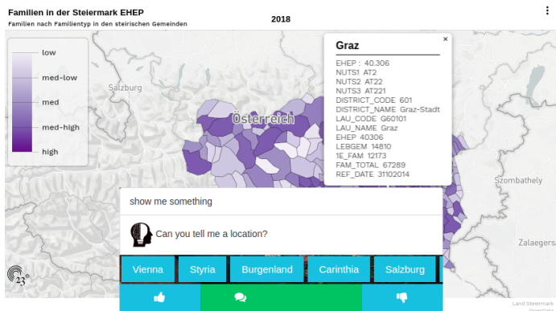

# Reboting
> chatbot that makes austria's geographical opendata queryable via visualizations for human beings

an interface that allows geo-queries
for Austrian federal states and automatically generates visualization of respective open datasets. The geo-labelling of the dataset is based on a base knowledge graph of geo-entities.

## Technologies
* angular
* express
* dialogflow
* mongodb
* 23degrees visualization api

## Publications
Heil, Erich, and Sebastian Neumaier. "reboting. com: Towards geo-search and visualization of austrian open data." European Semantic Web Conference. Springer, Cham, 2018.

* [Link to Paper](https://bit.ly/35kpkIT)
